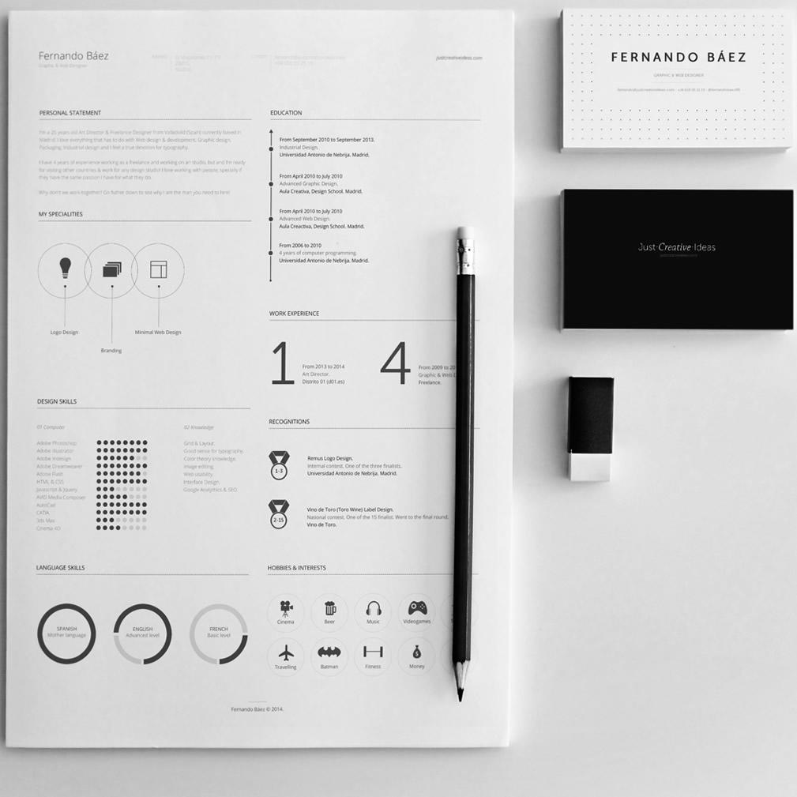

# Zresume 简历主题

[](https://hub.docker.com/r/zuolan/resume/)  [](https://hub.docker.com/r/zuolan/resume/)  [](https://hub.docker.com/r/zuolan/resume/)

这是一个 [Grav CMS](http://getgrav.[]/) 的程序员简历主题。



## 特色

* 轻量，无需数据库。
* 支持密码验证访问，避免完全公开简历。
* 直接使用 Markdown 编写简历，实时解析页面。
* 简历所有图标、文字、排版均在 Markdown 中设置，无需修改代码。
* 支持 Docker 一键部署，镜像体积约 30MB。
* 支持静态页面导出，你可以把简历托管到Github Pages等地方。

## 使用方法

### 快速启动（Demo）

直接执行下面命令：

```shell
curl -sSL https://git.io/Resume | bash
# 指定端口，如果你的 8080 端口已经使用，可以指定其他端口，例如指定 2333 端口：
curl -sSL https://git.io/Resume | bash -s 2333
```

> 脚本会安装 Docker（如果没有安装的话），然后下载一个 30MB 左右的 Docker 镜像，启动时默认会占用 8080 端口（当然你可以修改），数据卷挂载到 `$HOME/resume` 目录。

在 `$HOME/resume` 目录中有三个文件夹，分别是 config、pages 和 static：

- config 是站点配置文件夹；
- pages 是简历的 Markdown 源文件；
- static 是导出静态页面的目录。

如果不喜欢只需要删除镜像（`docker rm -f resume && docker rmi zuolan/resume`）和`~/Resume`目录即可完全卸载。

### 导出静态页面

导出静态页面之前，你需要执行上面“快速启动”的步骤，这样才能在本地看到一份 Markdown 简历模板，然后修改这份。

```shell
docker run --rm -it --name static_resume \
    -v ~/Resume/themes:/usr/html/user/themes \
    -v ~/Resume/pages:/usr/html/user/pages \
    -v ~/Resume/config:/usr/html/user/config \
    -v ~/Resume/static/:/usr/html/static \
    zuolan/resume generate
```

静态页面会保存到`$HOME/Resume/static`文件夹，然后你可以上传到一些静态页面托管服务上。简历静态页面更新只需要再执行一次上面命令即可。

> **静态导出插件和密码访问不能同时共存。**

### 密码访问

直接手动启动：

```shell
docker run -d --name resume \
  -e PASSWORD=5baa61e4c9b93f3f0682250b6cf8331b7ee68fd8 \ # 此为"password"的sha_1混淆
  -p 6666:80 \
  --restart=always \
  -v ~/Resume/themes:/usr/html/user/themes \
  -v ~/Resume/pages:/usr/html/user/pages \
  -v ~/Resume/config:/usr/html/user/config \
  zuolan/resume
```

在线密码生成器：http://www.sha1-online.com ，在这个网站生成一个密码混淆，填写到启动命令中。

### 快速获取 Github 日历

```
curl https://github.com/izuolan | awk '/<svg.+class="js-calendar-graph-svg"/,/svg>/' | sed -e 's|<svg|<svg xmlns="http://www.w3.org/2000/svg"|' | sed '/text/'d > github.svg
```

## 修改主题

如果你需要修改主题具体样式，可以把主题文件夹也挂载到数据卷中：

```shell
# 使用下面脚本快速安装 Docker：
# curl -sSL https://get.docker.com/ | sh

$ RESUME_PATH="$HOME/resume" # 设置简历存储在本地的目录
$ RESUME_PORT="8080"         # 设置访问简历的端口
$ mkdir -p $RESUME_PATH

# 获取示例文件
$ docker run -d --name resume_tmp zuolan/resume
$ docker cp resume_tmp:/usr/html/user/config $RESUME_PATH/config
$ docker cp resume_tmp:/usr/html/user/pages $RESUME_PATH/pages
$ docker cp resume_tmp:/usr/html/user/themes $RESUME_PATH/themes
$ docker rm -f resume_tmp resume

# 启动简历容器
$ docker run -d --name resume \
  -p 8080:80 \
  --restart=always \
  -v /resume/themes:/usr/html/user/themes \
  -v /resume/pages:/usr/html/user/pages \
  -v /resume/config/:/usr/html/user/config \
  zuolan/resume
```

## 相关

主题最初从 [Resume](https://github.com/getgrav/grav-theme-resume) 主题 Fork 过来，原主题很久没更新了;

有大佬用 Swift 实现了一个：[EFResume](https://github.com/EyreFree/EFResume);

MIT协议开源。

## 提示

`config`文件夹改动之后要重启容器才能生效，`pages`文件夹改动是即时生效的。
